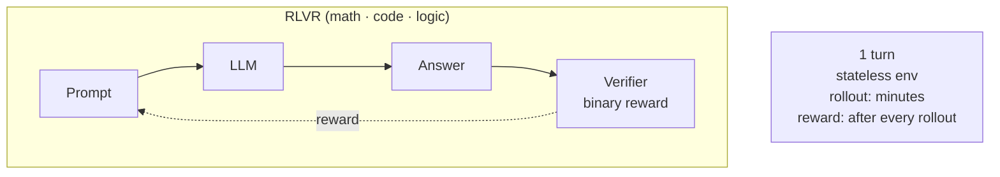
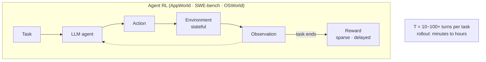

	强化学习已经逐步成为自主智能体系统的核心支撑技术，但技术迁移过程并非简单套用，从适配大语言模型的强化学习切换到面向完整智能体的强化学习体系时，会诞生一系列以往未曾凸显的棘手问题。其一为环境适配问题，智能体需要对接复杂多变的真实交互环境，而非大模型单纯的，而非大模型单纯的文本输入输出场景；其二是轨迹推演环节，智能体多轮行动轨迹的生成、记录与回传复杂度大幅提升；其三是工具调用管控，智能体具备调用外部工具执行任务的能力，强化学习很难同步适配工具调用逻辑；其四存在推理速度瓶颈，智能体多轮思考推理会拖慢强化学习迭代效率；其五奖励设计难度陡增，单一文本反馈奖励不再适用多动作链式任务；最后现实场景中多步骤连贯行为的效果量化评估缺少成熟标准，这六大难点共同制约着智能体强化学习的落地进度。

## 1. RLVR closes the loop in one turn. Agents don't
当前主流后训练方法都是基于各类数学、代码、推理等 benchmark 任务集使用**可验证性奖励**来进行策略优化来提升模型深度思考能力，这些 benchmark 大多为 QA 单轮的形式进行测试：

而对于真实 Agent 环境则是：

在长程推理环境，例如软件工程，整个部署到开发过程将会非常长，需要数小时到数天，而且需要 Agent 做出长程规划，在非常多个 RLVR loop 中不断循环，经历 T 轮交互后最终得到一个稀疏奖励。针对中间的过程奖励目前大多基于 prompt 的形式给出标签，但这种方式本质还是在做监督学习，很难拓展规模（目前还没有方法能证明拓展性）。

## Enviroment

1. https://github.com/NVIDIA-NeMo/Gym
	NeMo Gym is a library for evaluating and improving models and agents using environments. NeMo Gym provides infrastructure to develop environments, scalably run evaluation and training, and a collection of popular benchmarks and training environments.
2. https://github.com/huggingface/OpenEnv
	An e2e framework for creating, deploying and using isolated execution environments for agentic RL training, built using Gymnasium style simple APIs.

# Long Horizon Agent
要详细拆解**Long Horizon Agent（长时序智能体）任务**，先把基础定义、核心痛点、技术架构、经典方案、评测场景、落地局限完整梳理，适配视频讲解的逻辑框架：

## 一、基础概念：什么是 Long Horizon Agent Task
### 1. 术语拆解
- **Agent（智能体）**：能感知环境、自主决策、执行动作、接收反馈、迭代调整的AI主体（大模型Agent、机器人Agent、游戏AI、软件操作Agent都属于）；
- **Horizon（时序跨度/规划长度）**：短时序（short horizon）：几步~几十步即时任务；**Long Horizon 长时序**：上百步、多阶段、跨子目标、耗时久、延迟反馈的复杂任务；
- **Long Horizon Agent Task**：智能体需要完成**多步骤、分层子目标、长间隔奖励、环境动态变化、中间无即时正确反馈**的长线复杂任务。

#### 直观对比
| 短时序Agent任务 | 长时序Agent任务 |
|----|----|
| 一句话翻译、单步点击、简单抓取 | 连续办公操作（开软件→导数据→做表→发邮件）、机器人组装零件、游戏通关全流程、长途导航规划、长期科研实验操作 |
| 每一步立刻能看到对错反馈 | 前面几十步操作对错，要等到最终结束才知道成败；中间局部正确不代表全局成功 |
| 规划长度≤20步 | 规划长度常≥100步，甚至上千步 |

### 2. 长时序任务独有的4大核心难点
#### 难点1：信用分配问题（Credit Assignment）
长链条里，最终只有结尾一个成败奖励，无法判断**哪一步出错**：
例：机器人泡茶：拿杯→接水→放茶叶→冲泡。最后水洒了，分不清是拿杯不稳、接水太多还是冲泡动作失误。
短任务每步有小奖励，长任务只有稀疏奖励（sparse reward），梯度/反思很难定位错误环节。

#### 难点2：状态遗忘与上下文衰减
大模型Agent依赖上下文窗口存储历史动作、环境状态；长线任务步骤极多：
1. 上下文塞满后早期关键信息被截断；
2. 模型对几百步前的约束、初始目标、前置条件记忆模糊；
3. 容易偏离总目标，陷入局部无效循环（反复做无意义操作）。

#### 难点3：复合分层子目标拆解难度高
长任务天然是**嵌套层级**：总目标→一级子目标→二级子任务→单步动作。
Agent容易出现：
- 拆解粒度失衡：拆太碎冗余、拆太粗无法执行；
- 子目标冲突：完成A子目标反而破坏B前置条件；
- 中途子目标完成后忘记切换下一阶段。

#### 难点4：环境动态扰动与容错不足
长线执行中环境会变：文件位置变动、物体移位、弹窗干扰、突发异常；
短任务容错高，一步错立刻修正；长任务一步微小错误会链式放大，到后期完全无法挽回。

## 二、Long Horizon Agent 主流技术方案
### 方案1：分层规划（Hierarchical Planning，最主流）
核心思想：把长任务拆成**高层规划器 + 底层执行器**两级结构
1. **高层（长时序规划层）**
大模型负责拆解总目标，输出一系列离散子目标序列（只定“要做什么”，不定精细动作）；
例：总目标“整理月度报表”→高层输出子目标：1导出上月数据 2清洗异常值 3生成图表 4抄送领导；
2. **底层（短时序执行层）**
小模型/工具调用模块，逐个完成单个子目标（几十步内短任务），每完成一个子目标给高层反馈状态；
3. 迭代修正：高层收到子目标失败信号，重新重规划下一阶段。
代表框架：LLM+Plan-Solve架构、HRL分层强化学习、Tree of Plans规划树。

### 方案2：记忆增强机制（解决遗忘问题）
专门对抗上下文衰减，给Agent外置持久记忆库，脱离LLM上下文窗口限制：
1. **情景记忆（Episodic Memory）**
存储历史完整轨迹：每一步动作、环境观测、子目标结果；长线任务可随时检索几百步前的操作记录；
2. **概要记忆（Summary Memory）**
定期自动压缩长轨迹：每20步生成一段精简摘要，替代原始冗余步骤存入上下文；避免窗口爆满；
3. **反思记忆（Reflective Memory）**
任务阶段性结束后复盘：总结哪段子流程出错、优化拆解逻辑，记忆复盘经验用于后续同类型长线任务。
典型实现：Vector DB向量记忆、Recall+Reflect双记忆模块。

### 方案3：稀疏奖励优化 & 信用分配修正
1. **中间伪奖励塑造**
人为/模型自动给每个完成的子目标分配小型奖励，把末尾单一稀疏奖励拆成多段密集中间奖励；
2. **回溯归因（Backward Attribution）**
任务失败后反向遍历整条轨迹，推理错误源头步骤：用LLM逐段诊断“该子阶段为何未达成”，精准定位信用责任；
3. **轨迹分段微调**
不拿整条上千步轨迹训练，按子目标切割分段，分段更新Agent策略，避免长梯度弥散。

### 方案4：迭代式自我校正（Rollout & Self-Correction）
1. 先让Agent完整跑一遍长线粗轨迹；
2. 分段扫描轨迹，识别停滞、循环、偏离目标的片段；
3. 局部重规划出错片段，替换错误动作链；
4. 多次rollout迭代收敛稳定长线执行能力。

### 方案5：强化学习适配长时序（RL for Long Horizon）
传统DQN、PPO很难处理上千步任务，改良方案：
- 优势函数分阶段估计；
- 时间差分TD窗口拉长；
- 分层强化学习HRL（高层选子任务，底层优化动作）；
多用于机器人、游戏智能体场景；纯LLM Agent更多用提示工程+规划，少原生RL。

## 三、标准评测数据集&任务场景
### 1. 软件操作类（LLM Agent最常见）
- Mind2Web、WebShop、WindowsAgent：跨页面、多软件、数十步到上百步网页/桌面操作；
典型长任务：网购完整流程、Excel批量数据处理、邮件批量归档；

### 2. 机器人具身智能（Embodied Long Horizon）
数据集：ALFRED、BabyAI、RoboTHOR
任务：全屋家务、物品组装、多房间取放转运，动辄100–500步机械动作；

### 3. 游戏环境
Minecraft、StarCraft、ViZDoom：生存建造、通关战役，超长时序探索与资源规划；

### 4. 推理科研类
多步骤数学证明、实验操作流程、代码大型工程搭建（分模块开发、调试、部署全链路）

#### 评测核心指标
1. **全局成功率**：整条长线任务最终是否完成；
2. **步骤效率**：完成目标所用总步数越少越好；
3. **循环率**：是否出现重复无效操作；
4. **子目标达成率**：分层拆解后的中间子目标完成比例；
5. **容错鲁棒性**：插入环境干扰后成功率下降幅度。

## 四、现有局限与前沿改进方向
### 当前短板
1. 超长千步以上任务稳定性差，极易中途跑偏；
2. 分层拆解高度依赖大模型推理能力，小参数量模型几乎无法驾驭长时序；
3. 记忆检索精度不足，容易调取无关历史轨迹误导决策；
4. 真实物理机器人硬件延迟、误差叠加，长时序物理落地难度远高于纯数字软件Agent。

### 前沿创新方向
1. 世界模型+长时序规划：用世界模型预推演未来数百步环境变化，提前预判风险；
2. 多智能体协作拆分长任务：多个Agent分工负责不同子目标；
3. 原生长上下文大模型（1M+上下文窗口）减少摘要压缩损耗；
4. 离线海量长线轨迹预训练，让模型天生学习复杂长流程范式。

### 核心主旨
Long Horizon Agent Task本质是**让AI智能体稳定驾驭百步以上、分层子目标、稀疏反馈、易遗忘跑偏的长线复杂任务**，行业主流解法围绕**分层规划、外置持久记忆、分段奖励归因、迭代自我校正**四大支柱搭建系统，目前在网页操作、具身机器人、游戏场景落地迭代最快。

如果你能提供视频名称/关键截图/原文片段，我可以对照视频逐句逐段逐帧对应解析里面的实验数据、框架流程图和对比消融实验结果。
